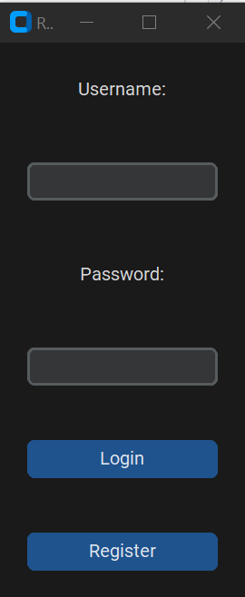
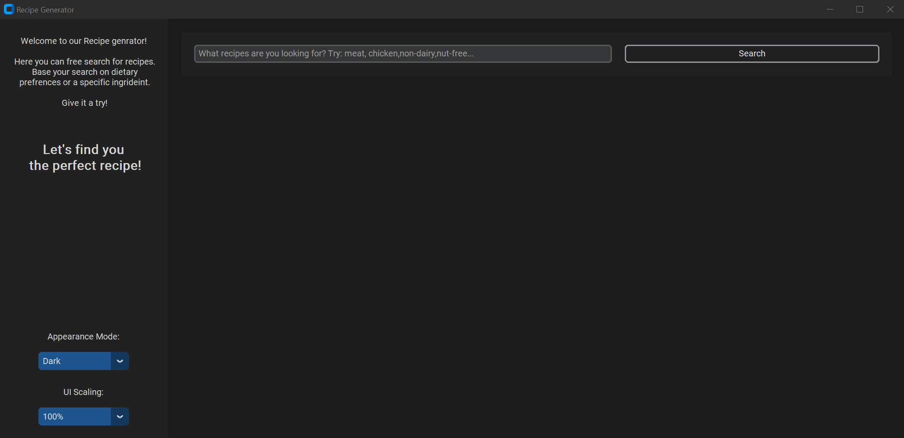
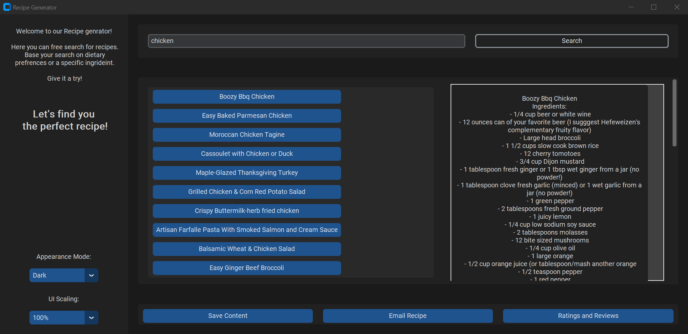
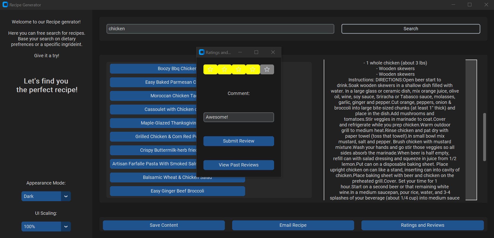
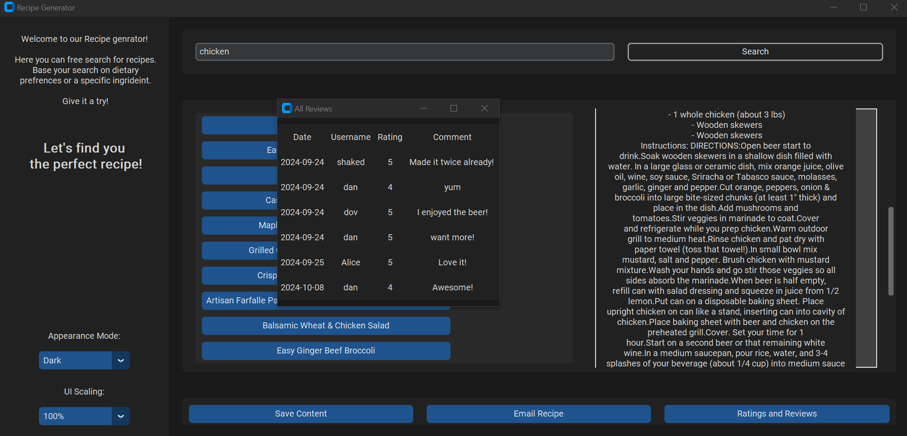

# Recipe Generator

For my mid-project in python I decided to create a recipe generator app. How this works?

With a clear and modern UI you can search for recipes, you can search for a specific recipe or just type in an ingridient and you will be offered a bunch of different recipes, which you can easily look through.

In order to get the recipes I used an API from a website called "spoonacular" (https://spoonacular.com/food-api), after the user type in his search it pulles it from the API.

## Let's walk through the app!

First, to make it a bit more interesting and personal I created a window for login where you have to prompt username and password which are being saved in a sqlite database, or create a new one.

Then the main window will open where you can type in your search.

Finally we see the recipes! Now you have the options to save it as a txt file, email it and even add ratings and reviews and read what other users wrote.

Submit a rating:

The ratings and reviews are also being stored in out database and pulled from there when we want to view the reviews for a specific recipe.

I hope you enjoyed!

